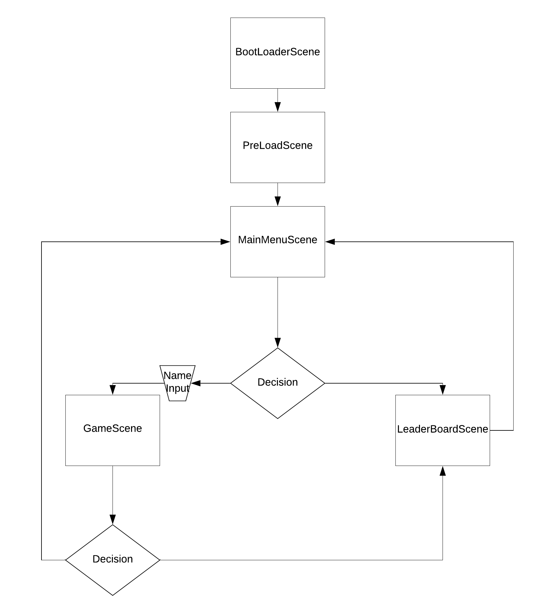

<h2> Game Design Document</h2>
 
This is the game design documentation for the JS Capstone project: Shooter Game.

## Table of Contents
- [High Concept](#high-concept)
- [Gameplay](#gameplay)
  - [Victory Conditions](#victory-conditions)
  - [Art](#art)
  - [Technical Aspects](#technical-aspects)
    - [Game flow](#game-flow)
    - [Third-Party Software Used](#third-party-software-used)
- [Milestone Schedule](#milestone-schedule)
  - [Day 1](#day-1)
  - [Day 2](#day-2)
  - [Day 3](#day-3)
  - [Day 4](#day-4)
  - [Day 5](#day-5)

# High Concept
Galaga is a 2D shooter arcade game where players go through un-ending waves of ever-increasing enemies.

# Gameplay

The player will shoot enemies that appear at random spots on the screen. The enemies will remain still and will shoot at fixed intervals. 

## Victory Conditions

There are no victory conditions.  The objective of the game is to last as much as one can to achieve a higher score

## Art

The game art must be pixel art and the highest resolution of said art must not exceed 32 bits. The background must be black with stars and animations to give the player the sensation of moving through the game. 

## Technical Aspects 

### Game flow
    
The flow of the game is as follows: 
    

### Third-Party Software Used

- Git hub
- npm
- Webpacker
- Phaser 3

# Milestone Schedule

## Day 1

Read the provided tutorials and find more resources to learn how to build a game using Phaser 3.

## Day 2

Build a game using a Phaser tutorial and keep searching for more resources if necessary. Gather pixel art and sound SFX assets.

## Day 3

Start building the game according to the game flow diagram. Get the player moving.

## Day 4

Spawn enemies and implement shooting mechanics to enemies and player entities.

## Day 5

Implement a scoring system and unit tests. Fix bugs.
