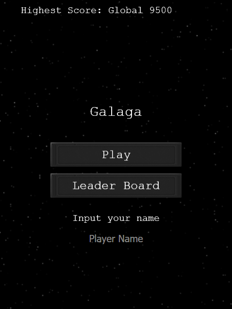

<!-- PROJECT SHIELDS -->
<!--
*** I'm using markdown "reference style" links for readability.
*** Reference links are enclosed in brackets [ ] instead of parentheses ( ).
*** See the bottom of this document for the declaration of the reference variables
*** for contributors-url, forks-url, etc. This is an optional, concise syntax you may use.
*** https://www.markdownguide.org/basic-syntax/#reference-style-links
-->

[![Contributors][contributors-shield]][contributors-url]
[![Forks][forks-shield]][forks-url]
[![Stargazers][stars-shield]][stars-url]
[![Issues][issues-shield]][issues-url]
[![MIT License][license-shield]][license-url]
[![LinkedIn][linkedin-shield]][linkedin-url]

<!-- PROJECT LOGO -->
<br />
<p align="center">
  

  <h3 class ="norse" align="center" style="@font-face {font-family: 'Norse'; src: url('/fonts/Norse.otf'); font-family:'Norse'}">Classic Galaga Game</h3>

  <p align="center">
    JavaScript Capstone Project
    <br />
    <br />
  </p>
</p>

<!-- TABLE OF CONTENTS -->

## Table of Contents

- [Table of Contents](#table-of-contents)
- [About The Project](#about-the-project)
  - [Built With](#built-with)
- [Getting Started](#getting-started)
  - [Installation](#installation)
- [Usage](#usage)
- [Contact](#contact)
- [Contributing](#contributing)
- [Show your support](#show-your-support)
- [Acknowledgments](#acknowledgments)
- [License](#license)

<!-- ABOUT THE PROJECT -->

## About The Project


This the last project of the Javascript module.

Project: JavaScript Capstone project, Shooter Game. [Assignment link](https://www.notion.so/microverse/Shooter-game-203e819041c7486bb36f9e65faecba27)


Visit the finished project website: [Live](https://jdmartinez1062.github.io/JS-CapstoneProject/dist/)
<div style="text-align:center">
  <a href="https://jdmartinez1062.github.io/JS-CapstoneProject/dist/">
      
  </a>
</div>

### Built With

- [JavaScript](https://www.javascript.com)
- [Webpack](https://webpack.js.org/)
- [Phaser](https://phaser.io/phaser3)

## Getting Started

### Installation

1. Clone the repo

```sh
git clone https://github.com/jdmartinez1062/JS-CapstoneProject
```

2. In order to install all dependencies, run:

    `npm install` or `yarn install`

<!-- USAGE EXAMPLES -->
## Usage

1. To run it locally run `npm start` and `npm run server`.

2. Click on play.

3. Use `SPACE` to shoot, `W` to move forwards, `S` to move backwards, `A` to move to the left and `D` to move to the right.

4. If you die press `ENTER` to go to the `Main Menu`
   
## Contact

Juan David Martínez Cubillos - jd.martinez1062@gmail.com

## Contributing

Contributions, issues and feature requests are welcome!

Feel free to check the [issues page](issues/).

## Show your support

Give a ⭐️ if you like this project!

## Acknowledgments
- Microverse for the opportunity.
- Jared York for his [tutorial](https://learn.yorkcs.com/build-a-space-shooter-with-phaser-3/) and assets.

## License

This project is [MIT](lic.url) licensed.


<!-- ACKNOWLEDGEMENTS -->


<!-- MARKDOWN LINKS & IMAGES -->
<!-- https://www.markdownguide.org/basic-syntax/#reference-style-links -->

[contributors-shield]: https://img.shields.io/github/contributors/jdmartinez1062/JS-CapstoneProject.svg?style=flat-square
[contributors-url]: https://github.com/jdmartinez1062/JS-CapstoneProject/graphs/contributors
[forks-shield]: https://img.shields.io/github/forks/jdmartinez1062/JS-CapstoneProject.svg?style=flat-square
[forks-url]: https://github.com/jdmartinez1062/JS-CapstoneProject/network/members
[stars-shield]: https://img.shields.io/github/stars/jdmartinez1062/JS-CapstoneProject.svg?style=flat-square
[stars-url]: https://github.com/jdmartinez1062/JS-CapstoneProject/stargazers
[issues-shield]: https://img.shields.io/github/issues/jdmartinez1062/JS-CapstoneProject.svg?style=flat-square
[issues-url]: https://github.com/jdmartinez1062/JS-CapstoneProject/issues
[license-shield]: https://img.shields.io/github/license/jdmartinez1062/JS-CapstoneProject.svg?style=flat-square
[license-url]: https://github.com/jdmartinez1062/JS-CapstoneProject/blob/master/LICENSE.txt
[linkedin-shield]: https://img.shields.io/badge/-LinkedIn-black.svg?style=flat-square&logo=linkedin&colorB=555
[linkedin-url]: https://linkedin.com/in/othneildrew
[product-screenshot]: imgs/screenshot.jpg

